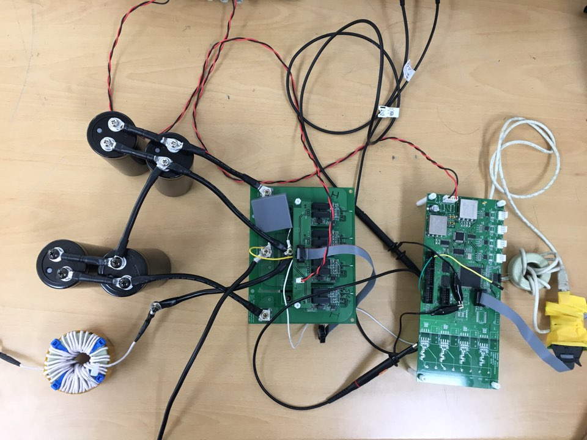

# I-did

우아한테크코스 증빙자료

- 대부분 private으로 관리합니다.

# 몰입 경험 증빙 자료

PDF
- [발표 pdf](https://github.com/yback1223/I-did/blob/master/Inverter.pdf)

Inverter 하드웨어

---
# 스터디 자료

## 백엔드 스터디

자바 스터디 자료

- [백긴선 프로님의 자바 스터디](https://github.com/yback1223/TIL/tree/master/Java/%EC%8A%A4%ED%84%B0%EB%94%94%20%EA%B3%BC%EC%A0%9C%20-%20%EB%B0%B1%EA%B8%B0%EC%84%A0)
- [자바의 정석 스터디](https://github.com/yback1223/TIL/tree/master/Java/%EC%9E%90%EB%B0%94%EC%9D%98%20%EC%A0%95%EC%84%9D%20%EC%8A%A4%ED%84%B0%EB%94%94)

SQL 스터디 자료

- [이것이 MySQL이다](https://github.com/yback1223/TIL/tree/master/MySQL/%EC%9D%B4%EA%B2%83%EC%9D%B4%20MySQL%EC%9D%B4%EB%8B%A4)

## 프론트엔드 스터디

프론트엔드 스터디

- [Colt from Udemy](https://github.com/yback1223/TIL/tree/master/Web/webClassColt)

---
# 독학 자료

JSP 독학 자료

- [JSP 2.3 정리](https://github.com/yback1223/TIL/tree/master/Web/JSP2.3)

OS 독학 자료

- [KOCW 반효경 교수님 - 운영체제](https://github.com/yback1223/TIL/tree/master/OS)

C언어 독학 자료

- [C언어 정리](https://github.com/yback1223/TIL/tree/master/C)

알고리즘 독학 자료

- [자바 자료구조](https://github.com/yback1223/TIL/tree/master/Data%20Structure)
- [알고리즘](https://github.com/yback1223/TIL/tree/master/Algorithm)

Spring 강의

- [김영한님의 Spring](https://github.com/yback1223/TIL/tree/master/spring)
